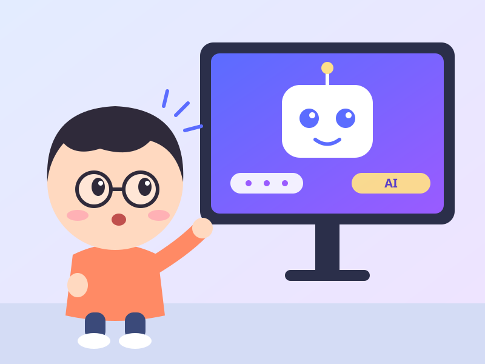

# Cẩm Nang Nâng Cấp Cuộc Sống

[中文](docs/README.md) | [English](docs/en/README.md) | Tiếng Việt

> Bản dịch tiếng Việt của [byoungd/up](https://github.com/byoungd/up) (byoungd and contributors),
> dịch từ [docs/en/](https://github.com/byoungd/up/tree/main/docs/en).
> Nội dung gốc theo giấy phép [CC BY-NC 4.0](https://creativecommons.org/licenses/by-nc/4.0/);
> bản dịch này cũng vậy. Thay đổi so với bản gốc: dịch sang tiếng Việt.

**Tác giả: Han Xiankai, bút danh "Li Pu"**

Phụ đề: **Cẩm nang học tập suốt đời cho kỷ nguyên AI**. Bản thảo luôn cập nhật này bắt đầu từ việc học tiếng Anh và tiếp tục mở rộng sang học AI, các dự án thực tế, khởi nghiệp, phục hồi, và công việc lấy lại cuộc đời của chính bạn bằng từng hành động nhỏ một.

  Bản thảo luôn cập nhật 
  <a href="./docs/vi/book-downloads.md">Trung tâm tải xuống</a> 
  <a href="./docs/public/downloads/life-level-up-guide-en.epub" download>Tải EPUB tiếng Anh</a> 
  <a href="./docs/public/downloads/life-level-up-guide-zh.epub" download>Tải EPUB tiếng Trung</a> 
  <a href="./docs/public/downloads/life-level-up-guide-en.pdf" download>Tải PDF tiếng Anh</a> 
  <a href="./docs/public/downloads/life-level-up-guide-zh.pdf" download>Tải PDF tiếng Trung</a> 
  <a href="https://github.com/byoungd/up">Nguồn và đính chính</a> 
  <a href="./docs/vi/templates/reader-field-note.md">Ghi chú thực tế dành cho người đọc</a> 
  <a href="https://creativecommons.org/licenses/by-nc/4.0/">Văn bản CC BY-NC 4.0</a> 

  

     BẮT ĐẦU TỪ ĐÂY 
    <h2 id="quick-start-title">Chọn một hành động trước khi chọn đọc bao nhiêu</h2>
    
Bạn không cần đọc toàn bộ cuốn sách trong lần truy cập đầu tiên. Hãy chọn một lối vào cho hôm nay, hoàn thành một hành động nhỏ, và để kết quả chỉ đường sang trang tiếp theo.

  

  

    <a class="quick-start-action" href="./docs/vi/threads/part-0/reader-guide.md"><strong>Tôi không biết bắt đầu từ đâu</strong> Hãy dùng Cẩm nang dành cho người đọc để chọn theo vấn đề và biết khi nào cần lưu giữ bằng chứng hoặc quay lại rà soát.</a>  
    <a class="quick-start-action" href="./docs/vi/templates/learning-state.md"><strong>Tôi muốn hoàn thành một việc hôm nay</strong> Dành năm phút để viết ra vấn đề thực sự, bằng chứng hiện có, hành động nhỏ nhất, và ranh giới của nó, trước khi quyết định bạn có cần bản ghi đầy đủ hay không.</a>  
    <a class="quick-start-action" href="./docs/vi/threads/part-1/0-cefr.md"><strong>Tôi muốn kiểm tra một kỹ năng tiếng Anh</strong> Hãy bắt đầu từ một tình huống thực tế, lưu lại mẫu đầu tiên, và chọn một tuyến luyện tập trong nghe, nói, đọc, hoặc viết.</a>  
  

AI đang khiến câu trả lời rẻ hơn bao giờ hết. Trong vài giây, chúng ta có thể nhận được một lời giải thích, một đoạn mã, một kế hoạch, thậm chí một lời khuyên cuộc sống nghe rất chắc chắn. Thứ vẫn khan hiếm lại đòi hỏi nhiều hơn: **biết câu hỏi nào đáng theo đuổi, quyết định bằng chứng nào đáng tin, biến gợi ý thành công việc thực chất, và chịu trách nhiệm cho phán đoán cuối cùng.**

Đây là một cẩm nang học tập suốt đời dành cho người bình thường. Nó không đòi hỏi bạn phải bắt đầu như một thiên tài, một chuyên gia, hay một người có kỷ luật hoàn hảo. Nó không hứa rằng một công cụ sẽ đổi thay số phận của bạn. Nó mang đến một cách để tiếp tục học trong khi thế giới ngày càng tăng tốc: gặp một vấn đề chưa từng quen, làm việc cùng AI mà không trao phó phán đoán, hoàn thành một việc thực sự, và mang bài học sang chặng đời tiếp theo.

Dự án bắt đầu năm 2017 với tên Cẩm nang Học tiếng Anh của Li Pu. Tiếng Anh từng là toàn bộ tấm bản đồ; giờ nó là một trong những con đường nền tảng trong bản đồ ấy. Cẩm nang đã mở rộng sang học AI, phát triển dự án, khởi nghiệp ở tầng tài nguyên, rà soát cuộc đời, và phục hồi. Điều này không xóa bỏ quá khứ. Nó hé lộ câu hỏi sâu hơn đứng sau mọi loại hình rèn luyện: **khi thế giới không ngừng thay đổi, liệu tôi có thể tiếp tục học, sáng tạo, và tham gia vào cuộc đời của chính mình không?**

Tôi tên là Han Xiankai, trên mạng còn được biết đến với tên Li Pu, và tôi đang giữ chức chủ tịch công ty China Token Cloud Computing Co., Ltd. Tôi thử nghiệm các phương pháp này trong học tập, phát triển phần mềm, dịch vụ doanh nghiệp, và đời sống thường ngày. Vai trò và các mối quan hệ thương mại của tôi cần được công khai. Những tuyên bố về năng lực, sản phẩm, và doanh thu phải được chứng minh bằng công việc, người dùng, chi phí, và thời gian.

Cẩm nang quay về một vòng lặp duy nhất:

**tìm một vấn đề → học chủ động → làm việc cùng AI → hoàn thành một việc thật → lưu giữ bằng chứng → rà soát và chuyển giao**

Nó cũng tách bạch ba loại tuyên bố:

- **Kết quả nghiên cứu** có kèm nguồn và nêu rõ phạm vi của bằng chứng;
- **Trải nghiệm cá nhân** giữ nguyên hơi ấm của nó mà không giả vờ là đơn thuốc dành cho mọi người;
- **Giả thuyết** có thể được nêu ra trong bàn luận, nhưng cuộc thí nghiệm tiếp theo phải kiểm chứng chúng.

  <section class="guide-path-group" aria-labelledby="guide-foundation">
01<h2 id="guide-foundation">Xây dựng nền tảng</h2>
Đặt vấn đề, ngôn ngữ và hành động hằng ngày trên cùng một bản đồ.

    <a class="guide-path" href="./docs/vi/templates/learning-state.md"><strong>Hệ thống học tập suốt đời</strong> Bắt đầu từ một vấn đề thực tế, một mốc năng lực hiện tại và một nhiệm vụ tối thiểu để mỗi chu kỳ có thể tiếp tục, được kiểm tra lại và chuyển giao.</a>  
    <a class="guide-path" href="./docs/vi/threads/part-1/0-cefr.md"><strong>Nền tảng: Tiếng Anh</strong> Dùng tiếng Anh để tiếp cận tri thức toàn cầu, tài liệu kỹ thuật và các công cụ AI quốc tế, bước vào môi trường làm việc đa văn hóa nhờ khả năng truyền đạt rõ ràng thay vì cố giống người bản xứ về phát âm.</a>  
    <a class="guide-path" href="./docs/vi/threads/part-1/grammar.md"><strong>Ngữ pháp để diễn đạt thực tế</strong> Bắt đầu từ việc thời gian, trách nhiệm, điều kiện và mức độ chắc chắn có được hiểu đúng hay không, rồi kiểm tra lại một cấu trúc có tác động lớn trong mười bốn ngày thay vì học thuộc mọi quy tắc trước.</a>  
    <a class="guide-path" href="./docs/vi/threads/part-1/6-writing.md"><strong>Viết và bàn giao không đồng bộ</strong> Giữ lại bản nháp tự viết, nguồn dẫn chứng và lý do chỉnh sửa để email, báo cáo, quyết định và bàn giao vẫn dùng được khi tác giả không trực tuyến.</a>  
  
</section>
  <section class="guide-path-group" aria-labelledby="guide-amplify">
02<h2 id="guide-amplify">Khuếch đại năng lực bằng công cụ</h2>
Để AI tăng tốc việc đặt câu hỏi và xác minh, trong khi con người giữ quyền phán đoán, kiểm thử và trách nhiệm.

    <a class="guide-path" href="./docs/vi/threads/part-3/1-ai-learning.md"><strong>Học mọi thứ với AI</strong> Dùng AI để đặt câu hỏi, nghiên cứu và nhận phản hồi, đồng thời giữ việc kiểm chứng sự thật và phán quyết cuối cùng trong tay con người.</a>  
    <a class="guide-path" href="./docs/vi/threads/part-3/2-ai-development-and-resource-layer.md"><strong>Dự án AI và kinh doanh tầng tài nguyên</strong> Tiến từ yêu cầu, bản mẫu, mã nguồn và kiểm thử đến truy cập mô hình, quản trị, bàn giao cho doanh nghiệp và thẩm định mô hình kinh doanh.</a>  
  
</section>
  <section class="guide-path-group" aria-labelledby="guide-life">
03<h2 id="guide-life">Bước vào đời sống thực</h2>
Mang việc học vào công việc, gia đình, các mối quan hệ và trách nhiệm của tác giả.

    <a class="guide-path" href="./docs/vi/threads/part-1/8-job-search-english.md"><strong>Tìm việc toàn cầu và làm việc từ xa</strong> Biến mô tả công việc thành giao tiếp với nhà tuyển dụng, giải thích dự án, xử lý câu hỏi xa lạ và viết không đồng bộ, rồi dùng sản phẩm thực để xác định khoảng trống tiếp theo cần vá.</a>  
    <a class="guide-path" href="./docs/vi/threads/part-4/family-learning.md"><strong>Gia đình và học tập cấp trung học cơ sở</strong> Để người học cùng tham gia xác định mục tiêu trong khi người lớn bảo vệ môi trường, quyền riêng tư và an toàn; dùng bằng chứng tích lũy trong mười bốn ngày thay vì giám sát hoặc làm thay.</a>  
    <a class="guide-path" href="./docs/vi/threads/part-2/care-and-carry-on.md"><strong>Chăm sóc những người xung quanh</strong> Biến sự chăm sóc thành lắng nghe, giúp đỡ thiết thực và cùng làm việc chung. Chấp nhận được hỗ trợ khi cả hai bên đều sẵn lòng và có khả năng, giữ sự ấm áp đi cùng ranh giới rõ ràng.</a>  
    <a class="guide-path" href="./docs/vi/threads/part-2/my-story.md"><strong>Cân xét lại cuộc đời và phục hồi</strong> Thừa nhận thất bại và cái giá phải trả, rồi xây dựng lại phán đoán, trật tự và hành động sau gián đoạn.</a>  
    <a class="guide-path" href="./docs/vi/projects.md"><strong>Dự án và thực hành của tác giả</strong> Công khai rõ ràng về liên kết, mục đích, ngày cập nhật và việc không nhận tài trợ để niềm tin không phụ thuộc vào sự đoán mò.</a>  
  
</section>
  <section class="guide-path-group guide-path-group-external" aria-labelledby="guide-external">
04<h2 id="guide-external">Tài nguyên bên thứ ba</h2>
Các điểm truy cập bên ngoài mang tính tùy chọn, không phải lời xác nhận về an toàn, chất lượng hay tuân thủ từ cuốn sách này hoặc tác giả.

    <a class="guide-path" href="https://biezou.com/" target="_blank" rel="noopener noreferrer"><strong>Gợi ý cầu nối AI: biezou.com</strong> Trang chính thức mô tả một cổng API AI hợp nhất và bảng điều khiển quản trị. Hãy coi đây là điểm truy cập bên thứ ba tùy chọn và tự kiểm tra điều khoản, giá cả, quyền riêng tư và tính khả dụng trước khi dùng.</a>  
    <a class="guide-path" href="https://t.me/OpenHuge_ai" target="_blank" rel="noopener noreferrer"><strong>Tài nguyên AI trên Telegram: OpenHuge_ai</strong> Một kênh Telegram bên thứ ba để khám phá tài nguyên AI. Bài đăng trên kênh, các liên kết ra ngoài và tính khả dụng đều có thể thay đổi; hãy kiểm chứng nguồn, quyền riêng tư, bản quyền và rủi ro bảo mật trước khi dùng.</a>  
  
</section>

## Kinh doanh, Kỷ luật và AI trong thực hành

Hãy dùng [Bản đồ thực hành](docs/vi/practice.md) để chọn một vấn đề bạn đang gặp và biến việc đọc thành một thí nghiệm nhỏ với kết quả có thể kiểm chứng. Các cẩm nang này bổ trợ cho bộ sách sáu phần và được đính kèm trong phần phụ lục số của bộ sách.

| Việc đang cần làm | Cẩm nang thực hành | Công cụ mẫu dùng lại được |
| --- | --- | --- |
| Một ý tưởng kinh doanh chưa có bằng chứng từ khách hàng | [Từ vấn đề đến khách hàng đầu tiên](docs/vi/threads/practice/customer-discovery.md) · [Một doanh nghiệp nhỏ bền vững](docs/vi/threads/practice/sustainable-business.md) | [Thí nghiệm khởi nghiệp](docs/vi/templates/startup-experiment.md) |
| Khó bắt đầu hoặc khó quay lại sau một thời gian gián đoạn | [Kỷ luật và tính bền bỉ](docs/vi/threads/practice/discipline-and-consistency.md) | [Kế hoạch bền bỉ](docs/vi/templates/consistency-plan.md) |
| AI tạo ra kết quả nhưng việc bàn giao không đáng tin cậy | [Quy trình làm việc với AI](docs/vi/threads/practice/ai-workflows.md) · [Đánh giá và độ tin cậy của AI](docs/vi/threads/practice/ai-evaluation.md) | [Hồ sơ đánh giá AI](docs/vi/templates/ai-evaluation.md) |

## Cấu trúc sách

Để đọc trọn vẹn, hãy bắt đầu với [Cẩm nang dành cho người đọc: Đưa cuốn sách trở lại cuộc sống](docs/vi/threads/part-0/reader-guide.md), rồi tiếp tục với [Lời tựa: Đừng vội thay đổi cuộc đời bạn](docs/vi/threads/part-0/prologue.md). Phần đầu giải thích cách chọn điểm khởi đầu, cách lưu giữ bằng chứng và cách quay lại sau khi gián đoạn; phần sau đặt những phương pháp đó vào câu chuyện cuộc đời của một con người. Cuốn sách này không phải là một con đường leo thẳng. Đó là một vòng lặp mà chúng ta quay lại nhiều lần:

Khi một thuật ngữ chưa rõ ràng hoặc bạn không biết nên mở trang nào tiếp theo, hãy dùng [Bảng chú giải thuật ngữ và phương pháp](docs/vi/reference/glossary.md) và đi theo trình tự “định nghĩa → bằng chứng → bước tiếp theo” để quay về lộ trình chính. Khi bạn không biết nên dùng bảng tính nào, hãy bắt đầu với [Tổng quan bộ công cụ](docs/vi/templates/toolkit.md) và chọn một điểm khởi đầu dựa trên vấn đề trước mắt bạn.

| Phần | Câu hỏi cốt lõi | Điểm khởi đầu |
| --- | --- | --- |
| Cẩm nang người đọc và Lời tựa | Tôi nên bắt đầu từ đâu, và tại sao lại bắt đầu lại? | [Cẩm nang người đọc](docs/vi/threads/part-0/reader-guide.md) · [Đừng vội thay đổi cuộc đời bạn](docs/vi/threads/part-0/prologue.md) |
| Phần I: Đầu vào mở | Làm thế nào để xây dựng cây cầu giữa tiếng Anh và thế giới, rồi đem năng lực vào phỏng vấn và cộng tác từ xa? | [Giới thiệu phần](docs/vi/threads/part-1/open-input.md) · [Tự đánh giá CEFR](docs/vi/threads/part-1/0-cefr.md) · [Từ vựng](docs/vi/threads/part-1/2-vocabulary.md) · [Ngữ pháp](docs/vi/threads/part-1/grammar.md) · [Nghe](docs/vi/threads/part-1/3-listening.md) · [Đọc](docs/vi/threads/part-1/4-reading.md) · [Nói](docs/vi/threads/part-1/5-speaking.md) · [Viết](docs/vi/threads/part-1/6-writing.md) · [Tiếng Anh tìm việc](docs/vi/threads/part-1/8-job-search-english.md) |
| Phần II: Trở về cuộc sống | Năng lực, công việc, các mối quan hệ, thất bại, lựa chọn và phục hồi ảnh hưởng đến nhau thế nào, và sự chăm sóc cùng trách nhiệm chung giúp chúng ta tiếp tục ra sao? | [Giới thiệu phần](docs/vi/threads/part-2/return-to-life.md) · [Câu chuyện của tôi](docs/vi/threads/part-2/my-story.md) · [Tôi vẫn ở đây: Vượt qua trầm cảm, lo âu và những ngày tối](docs/vi/threads/part-2/depression-anxiety-recovery.md) · [Tự sự và bằng chứng](docs/vi/threads/part-2/narrative-and-evidence.md) · [Phục hồi, quyết định và các mối quan hệ](docs/vi/threads/part-2/recovery.md) · [Chăm sóc và trách nhiệm chung](docs/vi/threads/part-2/care-and-carry-on.md) · [Khởi nghiệp](docs/vi/threads/part-2/entrepreneurship.md) |
| Phần III: Khuếch đại năng lực | Làm thế nào để dùng AI mà không trao phó phán đoán hay sự chú ý của mình? | [Giới thiệu phần](docs/vi/threads/part-3/amplify-ability.md) · [Học AI](docs/vi/threads/part-3/1-ai-learning.md) · [Sự chú ý, sản phẩm và bằng chứng](docs/vi/threads/part-3/3-attention-and-judgment.md) · [Thực hành dự án](docs/vi/threads/part-3/2-ai-development-and-resource-layer.md) |
| Phần IV: Thực hành và phục hồi | Làm thế nào để việc học trở về với cơ thể, gia đình và đời sống hằng ngày, đồng thời bảo vệ quyền tự chủ của người học nhỏ tuổi khi liên quan? | [Giới thiệu phần](docs/vi/threads/part-4/practice-and-recovery.md) · [Thực hành tuần đầu](docs/vi/threads/part-4/week-1.md) · [Học tập trong gia đình](docs/vi/threads/part-4/family-learning.md) · [Hệ thống hằng ngày](docs/vi/threads/part-4/daily-system.md) · [Nhịp điệu](docs/vi/threads/part-4/rhythm-and-compounding.md) |
| Phần V: Hành động dài hạn | Chín mươi ngày, một dự án thực tế và giai đoạn sau đó giúp một phương pháp giữ được trách nhiệm giải trình thế nào? | [Giới thiệu phần](docs/vi/threads/part-5/long-term-action.md) · [Kế hoạch hành động 90 ngày](docs/vi/threads/part-5/90-day-plan.md) · [Nghiên cứu trường hợp cuốn sách](docs/vi/threads/part-5/book-as-proof.md) · [Sau chín mươi ngày](docs/vi/threads/part-5/after-90-days.md) |
| Phần VI: Làm bạn trọn đời với chính mình | Làm thế nào để thấu hiểu, nhận ra, chăm sóc và hoàn thiện bản thân, đồng thời luôn bên mình qua mọi thay đổi? | [Thấu hiểu bản thân](docs/vi/threads/part-6/1-understanding-yourself.md) · [Hiểu mình](docs/vi/threads/part-6/2-knowing-yourself.md) · [Đối tốt với bản thân](docs/vi/threads/part-6/3-being-kind-to-yourself.md) · [Hoàn thiện bản thân](docs/vi/threads/part-6/4-improving-yourself.md) · [Làm bạn trọn đời với chính mình](docs/vi/threads/part-6/5-being-your-own-lifelong-friend.md) |
| Lời kết | Sau khi nâng cấp bản thân, tôi muốn trở thành người như thế nào? | [Bước tiến lớn nhất là tìm thấy chính mình](docs/vi/threads/part-6/afterword.md) |

## Bắt đầu bằng Một Hành động Nhỏ Hôm nay

Học tập suốt đời không phải là mở cùng lúc mười khóa học. Đó là hoàn thành một việc hôm nay để lại dấu vết:

1. Chọn một vấn đề thực tế: một bước bị vướng mắc trong công việc, một khái niệm bạn cần hiểu, một người bạn muốn giúp đỡ, hoặc một dự án nhỏ còn bỏ dở.
2. Ghi lại điểm xuất phát của bạn trong [Trạng thái học tập](docs/vi/templates/learning-state.md): những gì bạn đã biết, những gì bạn chưa làm được, và điều gì được tính là hoàn thành. Với các quyết định, sự tập trung, các mối quan hệ hoặc phục hồi, hãy dùng [Bộ công cụ Thực hành Cuộc sống](docs/vi/templates/life-practice-toolkit.md); cho một chu trình đầy đủ, hãy sao chép [Bản đồ Chu trình 90 ngày](docs/vi/templates/90-day-cycle.md).
3. Nhờ AI hỗ trợ xây dựng một nhiệm vụ kéo dài 25–45 phút, sau đó tự kiểm chứng nguồn tài liệu, tự đưa ra lựa chọn và tự hoàn thành sản phẩm.
4. Lưu lại một trang ghi chép, một đoạn mã, một bản ghi âm, một email hoặc phần phản hồi, thay vì chỉ lưu cuộc trò chuyện.
5. Một tuần sau, dùng [Xem lại Hàng tuần](docs/vi/templates/weekly-review.md) để đánh giá mức độ hoàn thành, chất lượng, khả năng ghi nhớ và vận dụng, trước khi chọn bước tiếp theo.

Bạn không cần phải nhìn thấy toàn bộ con đường. Bằng chứng đầu tiên bạn lưu lại hôm nay sẽ trở thành nơi để bước tiếp theo có thể đặt chân lên.

## Học AI và thực hành dự án: Từ câu trả lời đến bàn giao

Khi công cụ thay đổi quá nhanh để theo kịp, hãy bắt đầu với [Xu hướng AI và lộ trình học tập](docs/vi/threads/part-3/6-ai-trends-and-learning-roadmap.md). Dùng [Thử nghiệm xu hướng AI](docs/vi/templates/ai-trend-radar.md) để biến một năng lực mới thành một phép so sánh nhỏ: kiểm tra nguồn sơ cấp, giữ lại một chuẩn đối chiếu thủ công, tính toàn bộ chi phí, rồi quyết định có tiếp tục hay không. Chương này tách phần quan sát khỏi các giả thuyết cho tương lai, đồng thời cho bạn thực hành về đầu vào đa phương thức, ngữ cảnh, agent, đánh giá, mô hình cục bộ và truy xuất nguồn gốc.

[Học bất cứ thứ gì với AI](docs/vi/threads/part-3/1-ai-learning.md) không bắt đầu bằng câu hỏi “Mô hình nào tốt nhất?” mà bắt đầu bằng “Tôi đang cố giải quyết vấn đề gì?”. [Sự chú ý](docs/vi/threads/part-3/3-attention-and-judgment.md) bổ sung câu hỏi còn thiếu về ranh giới đầu vào, trọng tâm và phán đoán độc lập; [Sản phẩm](docs/vi/threads/part-3/4-artifacts-and-delivery.md) đưa sự hiểu biết tiến về một sản phẩm bàn giao được; còn [Bằng chứng](docs/vi/threads/part-3/5-evidence-and-transfer.md) kiểm tra hiệu quả trước mắt, khả năng ghi nhớ về sau và việc vận dụng vào thực tế. AI có thể đặt câu hỏi dẫn dắt, giải thích khái niệm, so sánh các lựa chọn, sắp xếp tư liệu và tạo bài luyện tập. Con người vẫn phải tự đặt mục tiêu, chọn nguồn đáng tin cậy, phát hiện thông tin bịa đặt, và sử dụng kiến thức một cách độc lập sau khi cuộc trò chuyện kết thúc.

Khi việc học bước vào dự án, [Học AI, phát triển dự án và khởi nghiệp trên tầng tài nguyên](docs/vi/threads/part-3/2-ai-development-and-resource-layer.md) mở rộng sự cộng tác sang yêu cầu, bản mẫu, mã nguồn, kiểm thử, tài liệu và bàn giao. Tốc độ không phải là thước đo duy nhất. Mọi quyết định quan trọng phải giải thích được, kiểm thử được hoặc hoàn tác được, và sự tiện lợi không bao giờ được xóa nhòa ranh giới quanh dữ liệu khách hàng, bí mật công ty hay quyền riêng tư của bên thứ ba.

Qua China Token Cloud và `token.love`, con đường này tiếp tục đi vào truy cập mô hình, định tuyến, đo lường mức dùng, phân quyền, triển khai, vận hành và hỗ trợ doanh nghiệp. Dự án có thể xem xét vì sao khách hàng sẵn sàng trả tiền, công việc cần được nghiệm thu ra sao, và chi phí có được bù đắp hay không. Nó không biến một hướng đi thành lời khẳng định về lợi nhuận đã được chứng minh, cũng không hứa hẹn rằng ai cũng có thể kiếm tiền với AI.

Phương pháp này không được xây dựng trong chân không. Thất bại phần mềm năm 2022 cho tôi thấy rằng bộ dữ liệu thiếu, kiến trúc lạc hậu và kết quả được cài sẵn có thể trốn sau giao diện và câu chuyện “AI” một thời gian, nhưng không thể trụ lại trước người dùng thật, chi phí thật và những sự cố thật. Thất bại ở đây không phải là chi tiết trang trí. Đó là lý do phương pháp này khăng khít đòi hỏi chuẩn đối chiếu, bằng chứng, khả năng hoàn tác, chi phí và trách nhiệm. Sau khi trở lại thực hành AI và ngành thực thể vào năm 2026, tôi vẫn coi mỗi hướng đi là công việc đang trong quá trình kiểm nghiệm, chứ không phải một kết quả đã bàn giao.

Sản phẩm có thể thay đổi. Một phương pháp vững chắc phải dùng được ở nhiều nơi. Dù mô hình giỏi đến đâu, việc kiểm chứng nguồn thông tin, an toàn dữ liệu, tiêu chuẩn nghiệm thu và trách nhiệm cuối cùng không thể thuê ngoài.

## Dành Cho Những Ai Vẫn Đang Tìm Hướng Đi

### Dành cho người trẻ

Ở tuổi hai mươi, bạn không cần phải tìm ra một hướng đi đúng đắn duy nhất cho cả đời. Nhiều hướng đi không hiện ra chỉ nhờ suy nghĩ. Chúng xuất hiện sau khi bạn đã hoàn thành vài dự án nhỏ, chứng kiến nhiều loại công việc khác nhau, và tự gánh hậu quả của vài quyết định. Lợi thế bền vững không nằm ở việc chọn được một con đường hoàn hảo, mà nằm ở việc giữ được khả năng học hỏi và thay đổi.

Nếu nỗi lo về sự nghiệp khiến bạn cứ sưu tầm các khóa học, chứng chỉ và những câu chuyện thành công, hãy đổi một phần bộ sưu tập đó lấy một dự án bạn có thể hoàn thành trong hai tuần. Giải quyết một vấn đề cho người xung quanh, làm ra một công cụ chạy được, viết một bài có dẫn nguồn, hoặc cải thiện một khâu trong quy trình của một người dùng thật. Dự án có thể thất bại, nhưng nó sẽ cho bạn biết mình thích gì, còn thiếu gì, có cam kết được hay không, và người khác có thấy kết quả hữu ích hay không.

AI có thể giảm chi phí khám phá, học hỏi và sáng tạo. Nhưng nó không thể xây dựng uy tín thay bạn. Những tài sản tích lũy theo thời gian là công việc nhìn thấy được, code, bài viết, phản hồi của khách hàng, ghi chú đánh giá, và mối quan hệ với những người sẵn sàng làm việc cùng bạn một lần nữa vì bạn trung thực và đáng tin cậy.

Đừng lấy khoảnh khắc rực rỡ của người khác ra để xét xử chính khởi đầu của mình. Hãy tự hỏi một câu hữu ích hơn: **tuần này tôi đã hoàn thành nhiều hơn một việc thật so với tuần trước chưa?** Nếu câu trả lời là có, dù việc đó nhỏ đến đâu, bạn đã đang xây con đường của mình rồi.

### Dành Cho Bất Kỳ Ai Đang Trải Qua Mùa Khó Khăn

Mất việc, làm ăn thất bại, một mối quan hệ đi đến hồi kết, sức khỏe suy giảm hay những tháng ngày bất định kéo dài đều có thể thực sự làm suy giảm khả năng hành động của một người. Thời điểm thấp điểm không phải là một bài thi mà bạn buộc phải chiến thắng ngay lập tức. Bạn không cần phải chứng minh, trong lúc kiệt sức nhất, rằng mình vẫn có thể thực hiện một cú lội ngược dòng ngoạn mục.

Hãy thu nhỏ cuộc sống lại trong phạm vi bạn có thể chăm sóc. Ngủ một đêm tương đối trọn vẹn. Ăn một bữa cơm. Bước ra ngoài. Trả lời một email quan trọng. Sắp xếp gọn gàng một trang ghi chép. Hoàn thành một bài kiểm tra. Nói với một người đáng tin cậy: "Tôi cần được giúp đỡ ngay bây giờ." Những hành động ấy trông không hề vĩ đại, nhưng chúng dần dần khôi phục sự kết nối của bạn với thế giới.

Dừng lại không phải là đầu hàng. Cầu xin sự giúp đỡ không phải là yếu đuối. Điều chỉnh lại bản thân không phải là thụt lùi. Phục hồi thường diễn ra chậm: trước hết hãy đặt vài giới hạn cho một ngày, sau đó dành cả một tuần để tìm lại nhịp điệu, rồi mới lên kế hoạch cho những bước xa hơn. Nếu hôm nay bạn chỉ có thể làm được trong năm phút, hãy giữ lại năm phút bằng chứng ấy. Hãy thêm trọng lượng khi sức mạnh trở lại.

Những câu chuyện cá nhân ở đây không phải là chăm sóc y tế hay trị liệu tâm lý. Nếu tâm trạng u sầu, mất ngủ, tuyệt vọng hay những suy nghĩ về việc tự gây tổn hại kéo dài, hãy liên hệ với một người bạn tin tưởng và tìm đến sự hỗ trợ y tế hoặc sức khỏe tâm thần địa phương có trình độ chuyên môn phù hợp. An toàn luôn đến trước sự phát triển.

## Nền tảng: Tiếng Anh vẫn là một cánh cửa quan trọng

Tiếng Anh không còn là tất cả những gì dẫn đường, nhưng vẫn là nền tảng cho việc học suốt đời. Nó giúp bạn đọc tri thức toàn cầu và tài liệu kỹ thuật, theo học các khóa học và nghiên cứu quốc tế, dùng được nhiều công cụ AI hơn, và làm việc xuyên văn hóa với ít sự trung gian hơn.

Hãy dùng [Mục tiêu CEFR và Tự kiểm tra](docs/vi/threads/part-1/0-cefr.md) để xác định điểm khởi đầu thực tế, sau đó bước vào [Nguyên tắc học tập](docs/vi/threads/part-1/1-understanding.md), [Từ vựng](docs/vi/threads/part-1/2-vocabulary.md), [Ngữ pháp](docs/vi/threads/part-1/grammar.md), [Nghe](docs/vi/threads/part-1/3-listening.md), [Đọc](docs/vi/threads/part-1/4-reading.md), [Nói](docs/vi/threads/part-1/5-speaking.md), [Viết](docs/vi/threads/part-1/6-writing.md), hoặc [Học tiếng Anh với AI](docs/vi/threads/part-1/7-ai.md) tùy theo yêu cầu của công việc. Nếu những quy tắc quen thuộc vẫn liên tục khiến bạn vướng về thời gian, trách nhiệm, điều kiện hoặc mức độ chắc chắn khi diễn đạt thực tế, hãy dùng [Thẻ dẫn chứng Ngữ pháp](docs/vi/templates/grammar-evidence.md) để theo dõi một cấu trúc có tác động lớn. Khi đọc tài liệu thấy chậm vì phải dịch từng từ, thiếu nền tảng về lĩnh vực, hoặc đọc xong vẫn không thể bàn giao kết quả, hãy dùng [Đọc](docs/vi/threads/part-1/4-reading.md) và [Thẻ dẫn chứng Đọc](docs/vi/templates/reading-evidence.md) để giữ cùng lúc phiên bản tài liệu, rào cản, các tuyên bố, thông tin tối thiểu và sản phẩm thực tế. Với một công việc kỹ thuật, hãy bắt đầu từ [danh sách từ vựng kỹ thuật](docs/vi/threads/word-list/Common.md) và chọn các cụm từ thuộc lĩnh vực liên quan. Bạn cũng có thể bắt đầu trực tiếp với [Bài chẩn đoán tiếng Anh](docs/vi/templates/english-diagnostic.md), [Thẻ dẫn chứng Từ vựng](docs/vi/templates/vocabulary-audit.md), [Thẻ dẫn chứng Nghe](docs/vi/templates/listening-audit.md), [Thẻ dẫn chứng Đọc](docs/vi/templates/reading-evidence.md), [Thẻ dẫn chứng Nói](docs/vi/templates/speaking-evidence.md), [Thẻ dẫn chứng Viết](docs/vi/templates/writing-evidence.md), hoặc [Thẻ Đặc tả sản phẩm và Bàn giao](docs/vi/templates/artifact-brief.md).

Khả năng tiếng Anh không được chứng minh bằng một kho từ vựng. Nó được chứng minh bằng những gì bạn có thể hiểu, diễn đạt và hoàn thành trong tình huống thực tế. Tiếng Anh là một cây cầu, không phải bức tường để đo giá trị của bạn.

Khi bốn kỹ năng chênh lệch nhau, đừng lấy trung bình rồi đưa ra kết luận. Hãy dùng [Bài chẩn đoán tiếng Anh](docs/vi/templates/english-diagnostic.md) để lưu giữ phiên bản đầu tiên của nghe, đọc, nói, viết trên cùng một chủ đề, chọn một rào cản và một thẻ dẫn chứng cho mỗi kỹ năng, thực hiện một bài tập song song sau bảy ngày, và kiểm tra lại một sản phẩm thực tế sau ba mươi ngày. Đây là cách giao thức nguyên tắc học tập bước vào lần thử tiếp theo.

## Nhìn lại cuộc sống và phục hồi: Trải nghiệm cũng cần được diễn giải lại

[Câu chuyện của tôi](docs/vi/threads/part-2/my-story.md), [Tự sự và bằng chứng](docs/vi/threads/part-2/narrative-and-evidence.md), [Tiếng vọng](docs/vi/threads/part-2/x-misc.md), [Phục hồi](docs/vi/threads/part-2/recovery.md), [Ra quyết định](docs/vi/threads/part-2/decision.md), [Các mối quan hệ](docs/vi/threads/part-2/relationships.md), [Chăm sóc](docs/vi/threads/part-2/care-and-carry-on.md), [Khởi nghiệp](docs/vi/threads/part-2/entrepreneurship.md) và [Kho lưu trữ](docs/vi/threads/archive/README.md) giữ lại những thất bại, những lần sức khỏe bị đổ vỡ, những mối quan hệ thay đổi, những cuộc rời đi và trở về. Nhìn lại không phải là cách tô điểm cho quá khứ để lấy cảm hứng. Việc này giúp tách biệt giữa sự thật, tổn thương, trách nhiệm và may mắn, để chúng ta có thể tự hỏi: quyết định nào đã hiệu quả, cái giá nào không được che giấu, và lần sau sẽ sống chân thực hơn với chính mình như thế nào. Chăm sóc đưa sự thấu hiểu đó trở lại với những người gần gũi: bày tỏ quan tâm, chia sẻ việc thiết thực, và sẵn sàng nhận sự giúp đỡ khi cả hai người đều đồng ý.

Trải nghiệm cá nhân không phải là lời khuyên y tế, pháp lý, đầu tư hay kinh doanh. Nội dung công khai tuân theo nguyên tắc tối thiểu hóa dữ liệu: không bộc lộ danh tính của người thứ ba khi không cần thiết, và chỉ giữ lại hình ảnh hay câu chuyện có liên quan đến người khác khi được phép rõ ràng và tôn trọng quyền riêng tư.

## Cuộc sống vẫn tiếp tục trôi

Một phương pháp chỉ bộc lộ sức mạnh của nó sau khi bước vào một cuộc đời. Những mối quan hệ kết thúc rồi có thể bắt đầu lại. Công việc thay đổi. Việc học có thêm ý nghĩa mới khi nó trở về với những con người thật và những vấn đề thật.

  <figure class="latest-update">
    
    <figcaption><strong>Một lần nữa tin vào cuộc gặp gỡ</strong> Sau khi một mối quan hệ khép lại, sau quá trình hồi phục và công cuộc sắp xếp lại cuộc sống, Hàn Tiên Khải đã bắt đầu một mối quan hệ mới. Bắt đầu lại không xóa đi quá khứ, nhưng cho thấy cuộc sống vẫn có thể tiếp tục lớn lên.</figcaption>
  </figure>
  <figure class="latest-update">
    
    <figcaption><strong>Ghé thăm Alibaba</strong> Tôi đã đến thăm Alibaba để tìm hiểu về Qwen tại khu trưng bày của họ.</figcaption>
  </figure>

## Các dự án của tác giả và công bố minh bạch

Các sản phẩm, chuyến thăm doanh nghiệp và dự án thực tế có liên quan đến Han Xiankai được trình bày tại [Các dự án và thực tiễn của tác giả](docs/vi/projects.md). Trang đó nêu rõ mối quan hệ, mục đích, ngày cập nhật và tình trạng không tài trợ. Các quan hệ thương mại không làm thay đổi tiêu chuẩn đề xuất của hướng dẫn; theo mặc định, trang web không sử dụng quảng cáo, phân tích hay công cụ theo dõi.

Bạn cũng có thể theo dõi tôi trên [X](https://x.com/ourleap) để cập nhật về thực hành AI, học tiếng Anh và phát triển bản thân.

## Ranh giới dự án

- Đây là một dự án nội dung mở, không phải phần mềm mã nguồn mở theo nghĩa của OSI. Văn bản và nội dung do tác giả tạo ra dùng giấy phép **CC BY-NC 4.0**; phần cấu hình trang, các bước kiểm tra và mã dựng dùng giấy phép **MIT**. Xem [Giấy phép](https://github.com/byoungd/up/blob/main/LICENSE.md).
- Nguồn và tình trạng giấy phép của các trích dẫn, hình ảnh và tư liệu bên thứ ba được ghi lại trong [Ghi nhận nguồn](https://github.com/byoungd/up/blob/main/ATTRIBUTIONS.md).
- Hãy đọc [Đóng góp](https://github.com/byoungd/up/blob/main/CONTRIBUTING.md) và [Quy tắc ứng xử](https://github.com/byoungd/up/blob/main/CODE_OF_CONDUCT.md) trước khi đóng góp.
- Ngày kiểm tra cho từng mục sản phẩm và dịch vụ được ghi trên từng trang và trong [Ghi nhận nguồn](https://github.com/byoungd/up/blob/main/ATTRIBUTIONS.md); phạm vi về năng lực, tính khả dụng và tuân thủ vẫn phải đối chiếu với trang chính thức, điều khoản chính thức và sự chấp nhận thực tế. Các ghi chú lỗi thời rất hoan nghênh được gửi dưới dạng issue.

## Đọc Trực Tuyến

- [GitHub Pages](https://byoungd.github.io/up/en/)
- [Kho lưu trữ GitHub](https://github.com/byoungd/up)

Nếu hôm nay bạn chỉ làm được một việc, hãy tạo một [Trạng thái học tập](docs/vi/templates/learning-state.md), ghi lại vấn đề thực sự đang đặt ra trước mắt bạn, những bằng chứng bạn có, và nhiệm vụ nhỏ nhất tiếp theo, rồi hoàn thành nó. Đừng chờ con đường trở nên rộng mở. Nhiều con đường chỉ xuất hiện sau khi bàn chân bạn đặt xuống.
